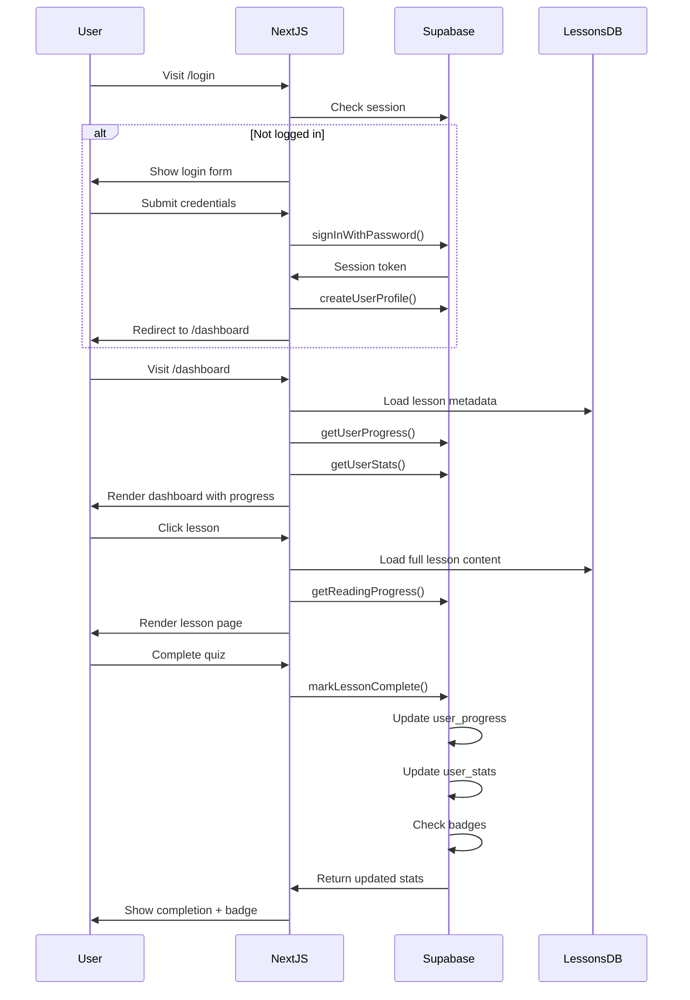
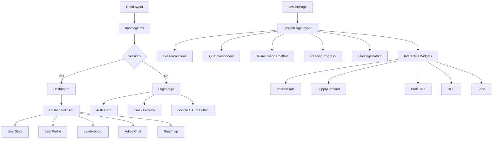

# Tự Học Tài Chính - Architecture Diagram

## System Architecture Overview

```mermaid
graph TB
    subgraph "Client Layer"
        A[User Browser]
        B[Next.js App]
    end
    
    subgraph "Next.js Application"
        C[app/page.tsx<br/>Root Redirect]
        D[app/login/page.tsx<br/>Authentication]
        E[app/dashboard/page.tsx<br/>Learning Dashboard]
        F[app/bai-hoc/[slug]/page.tsx<br/>Lesson Pages]
        G[app/profile/page.tsx<br/>User Profile]
        H[app/settings/page.tsx<br/>Settings]
    end
    
    subgraph "Components Layer"
        I[DashboardClient]
        J[LessonPageLayout]
        K[TaiTaiLesson<br/>AI Chatbot]
        L[FloatingChatbot<br/>Admin Contact]
        M[UserStats]
        N[UserProfile]
        O[Leaderboard]
        P[Interactive Widgets<br/>Interest Rate, Bond, etc.]
    end
    
    subgraph "Business Logic Layer"
        Q[lib/auth.ts<br/>Session Management]
        R[lib/lessons.ts<br/>Lesson Content]
        S[lib/supabase-*.ts<br/>Database Operations]
        T[lib/progress.ts<br/>Local Progress]
        U[lib/badges.ts<br/>Badge System]
        V[lib/levels.ts<br/>XP & Levels]
    end
    
    subgraph "Database Layer - Supabase"
        W[(lessons table)]
        X[(user_profiles table)]
        Y[(user_progress table)]
        Z[(user_stats table)]
        AA[(user_badges table)]
        AB[(reading_progress table)]
    end
    
    subgraph "External Services"
        AC[Google OAuth]
        AD[Supabase Auth]
    end
    
    A --> B
    B --> C
    B --> D
    B --> E
    B --> F
    B --> G
    B --> H
    
    E --> I
    F --> J
    F --> K
    F --> P
    E --> M
    E --> N
    E --> O
    F --> L
    
    I --> S
    J --> S
    K --> S
    M --> S
    N --> S
    O --> S
    D --> Q
    D --> S
    
    S --> W
    S --> X
    S --> Y
    S --> Z
    S --> AA
    S --> AB
    
    D --> AC
    D --> AD
    S --> AD
    
    I --> R
    J --> R
    R --> T
    S --> U
    S --> V
```

## Data Flow Diagram



## Database Schema Relationships

```mermaid
erDiagram
    auth.users ||--o{ user_profiles : "references"
    user_profiles ||--o{ user_progress : "has"
    user_profiles ||--o| user_stats : "has"
    user_profiles ||--o{ user_badges : "earns"
    user_profiles ||--o| reading_progress : "tracks"
    lessons ||--o{ user_progress : "tracked in"
    
    auth.users {
        uuid id PK
        string email
        string full_name
    }
    
    user_profiles {
        uuid id PK
        string email UK
        string full_name
        string avatar_url
        string bio
        int current_level
        int total_xp
        int lessons_completed
        float avg_quiz_score
        int current_stage
        string preferred_track
        boolean dark_mode
        timestamp created_at
        timestamp updated_at
    }
    
    user_stats {
        bigint id PK
        uuid user_id FK UK
        int total_lessons_completed
        int total_xp
        int current_level
        float avg_quiz_score
        int longest_streak
        timestamp last_lesson_date
        float total_study_time_hours
    }
    
    lessons {
        bigint id PK
        string slug UK
        string title
        string subtitle
        int stage_number
        int day_number
        string duration
        string difficulty
        string track
        string status
        timestamp created_at
    }
    
    user_progress {
        bigint id PK
        uuid user_id FK
        bigint lesson_id FK
        boolean completed
        timestamp completed_at
        int quiz_score
        int time_spent_seconds
    }
    
    user_badges {
        bigint id PK
        uuid user_id FK
        string badge_id
        timestamp earned_at
    }
    
    reading_progress {
        bigint id PK
        uuid user_id FK
        bigint lesson_id FK
        int max_percent_reached
        boolean milestone_25
        boolean milestone_50
        boolean milestone_75
        boolean milestone_100
    }
```

## Component Hierarchy



## Key Modules and Responsibilities

### Authentication Module
- **Files**: `lib/auth.ts`, `lib/supabase.ts`, `app/login/page.tsx`, `app/auth/`
- **Responsibilities**: 
  - Email/password authentication
  - Google OAuth integration
  - Session management
  - User profile creation

### Lesson Management Module
- **Files**: `lib/lessons.ts`, `app/bai-hoc/[slug]/page.tsx`, `components/LessonPageLayout.tsx`
- **Responsibilities**:
  - Store 200+ lesson definitions
  - Render lesson content with rich formatting
  - Handle quiz functionality
  - Track reading progress

### Progress Tracking Module
- **Files**: `lib/supabase-progress.ts`, `lib/progress.ts`, `lib/supabase-reading.ts`
- **Responsibilities**:
  - Track lesson completion
  - Store quiz scores
  - Monitor reading progress
  - Calculate streaks

### Gamification Module
- **Files**: `lib/badges.ts`, `lib/levels.ts`, `lib/supabase-badges.ts`
- **Responsibilities**:
  - XP calculation and leveling
  - Badge awarding system
  - Leaderboard generation
  - User stats aggregation

### Dashboard Module
- **Files**: `app/dashboard/page.tsx`, `components/DashboardClient.tsx`
- **Responsibilities**:
  - Track selection (Personal vs Professional)
  - Stage organization
  - Progress visualization
  - Lesson navigation

## Technology Stack

### Frontend
- **Framework**: Next.js 16.2.9 (App Router)
- **UI**: React 19.2.4
- **Styling**: TailwindCSS 4
- **Animations**: Framer Motion 12.42.2
- **Icons**: Lucide React 1.22.0
- **Charts**: Recharts 3.9.1
- **Language**: TypeScript 5

### Backend
- **Database**: Supabase (PostgreSQL)
- **Authentication**: Supabase Auth
- **ORM**: Supabase Client SDK

### Key Features
- Two-track learning system (Personal vs Professional)
- 200+ days of curriculum
- Interactive widgets for financial concepts
- AI chatbot assistant (TaiTai)
- Progress tracking with XP and badges
- Reading progress with milestones
- Leaderboard system
- Dark mode support
- Responsive design

## Security Features
- Content Security Policy (CSP) headers
- X-Frame-Options: DENY
- X-Content-Type-Options: nosniff
- Referrer-Policy: strict-origin-when-cross-origin
- Permissions-Policy: restricted
- Supabase RLS (Row Level Security)
- Environment variable protection
